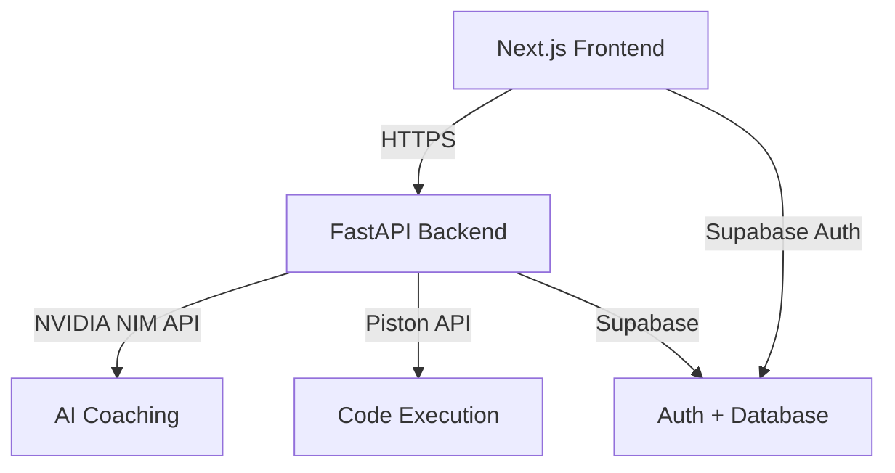

# Phase 2 Implementation Plan - CodeCoach AI

## Overview
This plan details the implementation of Phase 2 - Full Stack development for CodeCoach AI, transitioning from the single-file MVP to a complete full-stack application with FastAPI backend, Next.js frontend, and all required integrations.

## Architecture Summary


## Project Structure
```
codecoach-ai/
├── frontend/
│   ├── src/
│   │   ├── app/
│   │   ├── components/
│   │   ├── lib/
│   │   └── types/
│   ├── package.json
│   └── next.config.js
├── backend/
│   ├── app/
│   │   ├── api/
│   │   ├── models/
│   │   ├── services/
│   │   └── main.py
│   ├── questions/
│   ├── requirements.txt
│   └── Dockerfile
├── shared/
│   └── types/
└── README.md
```

## Implementation Phases

### Phase 2.1 - Project Setup & Infrastructure
**Goal**: Establish the monorepo structure and basic deployment pipeline

#### Tasks:
1. **Initialize Monorepo**
   - Create `/frontend` and `/backend` directories
   - Set up GitHub repository with branch protection
   - Configure `.gitignore` files for both projects

2. **Frontend Setup**
   - Initialize Next.js 14 with TypeScript and App Router
   - Install dependencies: `@monaco-editor/react`, `@supabase/ssr`, `next-themes`, `tailwindcss`
   - Configure Tailwind CSS with dark theme
   - Set up environment variables template

3. **Backend Setup**
   - Initialize FastAPI project structure
   - Install dependencies: `fastapi`, `uvicorn`, `httpx`, `python-dotenv`, `slowapi`
   - Create Dockerfile for containerization
   - Set up requirements.txt

4. **Deployment Configuration**
   - Configure Vercel for frontend auto-deployment
   - Set up Render for backend hosting
   - Create environment variable templates for both platforms

### Phase 2.2 - Backend API Development
**Goal**: Implement all FastAPI endpoints and services

#### Core Endpoints:
1. **POST /api/coach** - AI coaching proxy
2. **POST /api/run** - Code execution via Piston
3. **GET /api/questions** - List all questions
4. **GET /api/questions/:id** - Get specific question
5. **GET /health** - Health check endpoint

#### Implementation Details:

**NVIDIA NIM Integration Service**:
```python
class NIMService:
    def __init__(self, api_key: str):
        self.api_key = api_key
        self.base_url = "https://integrate.api.nvidia.com/v1"
    
    async def get_coaching_response(
        self, 
        problem: str, 
        code: str, 
        language: str, 
        message: str, 
        mode: str
    ) -> AsyncIterator[str]:
        # Model routing logic
        # Streaming response handling
```

**Piston Integration Service**:
```python
class PistonService:
    async def execute_code(
        self, 
        language: str, 
        code: str, 
        version: str = None
    ) -> dict:
        # Code execution with timeout
        # Error handling and sanitization
```

**Rate Limiting**:
- 10 requests per minute per IP on `/api/coach`
- IP-based tracking with Redis (or in-memory for free tier)

### Phase 2.3 - Frontend Migration
**Goal**: Migrate from single HTML file to Next.js React components

#### Component Structure:
```
components/
├── layout/
│   ├── Header.tsx
│   ├── Sidebar.tsx
│   └── Layout.tsx
├── editor/
│   ├── CodeEditor.tsx
│   ├── LanguageTabs.tsx
│   └── OutputBar.tsx
├── chat/
│   ├── AIChatPanel.tsx
│   ├── MessageBubble.tsx
│   └── QuickActions.tsx
├── questions/
│   ├── QuestionCard.tsx
│   └── QuestionList.tsx
└── auth/
    ├── LoginButton.tsx
    └── UserProfile.tsx
```

#### Key Features to Implement:
1. **Monaco Editor Integration**
   - Language switching (Python, JavaScript, Java)
   - Syntax highlighting and IntelliSense
   - Theme matching dark/light mode

2. **Real-time Chat Interface**
   - Server-Sent Events for streaming responses
   - Message history persistence
   - Typing indicators and animations

3. **Responsive Design**
   - Collapsible sidebar for tablets
   - Stacked layout for mobile
   - Touch-friendly interactions

### Phase 2.4 - Supabase Integration
**Goal**: Add authentication and user progress tracking

#### Database Schema:
```sql
-- User progress tracking
CREATE TABLE user_progress (
    id uuid PRIMARY KEY DEFAULT gen_random_uuid(),
    user_id uuid REFERENCES auth.users ON DELETE CASCADE,
    question_id text NOT NULL,
    status text CHECK (status IN ('attempted', 'solved')),
    language text,
    code text,
    solved_at timestamptz,
    attempts integer DEFAULT 0,
    UNIQUE(user_id, question_id)
);

-- Interview sessions (Phase 3 prep)
CREATE TABLE interview_sessions (
    id uuid PRIMARY KEY DEFAULT gen_random_uuid(),
    user_id uuid REFERENCES auth.users ON DELETE CASCADE,
    question_id text NOT NULL,
    start_time timestamptz NOT NULL,
    end_time timestamptz,
    final_code text,
    code_snapshots jsonb DEFAULT '[]'::jsonb
);
```

#### Authentication Flow:
1. GitHub OAuth via Supabase
2. JWT token validation in FastAPI middleware
3. Protected API routes requiring valid session

### Phase 2.5 - Question Bank Expansion
**Goal**: Grow from 6 to 50+ curated problems

#### Categories and Distribution:
- **Arrays & Hashing**: 10 problems
- **Two Pointers & Sliding Window**: 8 problems
- **Stack & Queue**: 6 problems
- **Binary Search**: 6 problems
- **Linked Lists**: 6 problems
- **Trees & Graphs**: 8 problems
- **Dynamic Programming**: 6 problems

#### Question Schema Enhancement:
```json
{
  "id": "problem-slug",
  "title": "Problem Name",
  "difficulty": "easy|medium|hard",
  "category": "Category Name",
  "company_tags": ["Google", "Meta", "Amazon", "Apple", "Microsoft"],
  "description": "Detailed problem description...",
  "starter": {
    "python": "starter code...",
    "javascript": "starter code...",
    "java": "starter code..."
  },
  "examples": [...],
  "test_cases": [...],
  "hints": [...],
  "solution": "optimal solution...",
  "time_complexity": "O(n)",
  "space_complexity": "O(1)"
}
```

### Phase 2.6 - Testing & Deployment
**Goal**: End-to-end testing and production deployment

#### Testing Strategy:
1. **Unit Tests**: Backend API endpoints
2. **Integration Tests**: Frontend-backend communication
3. **E2E Tests**: Complete user workflows
4. **Performance Tests**: API response times under load

#### Deployment Checklist:
- [ ] Environment variables configured on Vercel
- [ ] Render deployment with health checks
- [ ] Supabase project setup and migrations
- [ ] Domain configuration (optional custom domain)
- [ ] SSL certificates and security headers
- [ ] Error monitoring and logging

## Technology Stack Details

### Frontend Dependencies:
```json
{
  "next": "^14.0.0",
  "react": "^18.2.0",
  "@monaco-editor/react": "^4.6.0",
  "@supabase/ssr": "^0.0.10",
  "@supabase/supabase-js": "^2.38.0",
  "tailwindcss": "^3.3.0",
  "next-themes": "^0.2.1"
}
```

### Backend Dependencies:
```txt
fastapi==0.104.1
uvicorn==0.24.0
httpx==0.25.0
python-dotenv==1.0.0
slowapi==0.1.9
pydantic==2.4.0
```

## Risk Mitigation

### Technical Risks:
1. **NVIDIA NIM Rate Limits**: Implement fallback to secondary model
2. **Piston API Reliability**: Add retry logic and timeout handling
3. **Supabase Free Tier Limits**: Monitor usage and plan upgrades
4. **Cross-Origin Issues**: Proper CORS configuration

### Cost Monitoring:
- Set up usage alerts for all free tier services
- Implement request logging and analytics
- Plan upgrade triggers based on usage patterns

## Success Criteria
- [ ] All API endpoints functional and tested
- [ ] Frontend successfully migrated to Next.js
- [ ] User authentication working with GitHub OAuth
- [ ] Question bank expanded to 50+ problems
- [ ] Code execution via Piston API reliable
- [ ] Zero-cost deployment on free tiers
- [ ] Performance: <2s initial load, <500ms API responses
- [ ] Mobile-responsive design

## Next Steps
1. Approve this implementation plan
2. Switch to Code mode for actual implementation
3. Begin with Phase 2.1 - Project Setup & Infrastructure