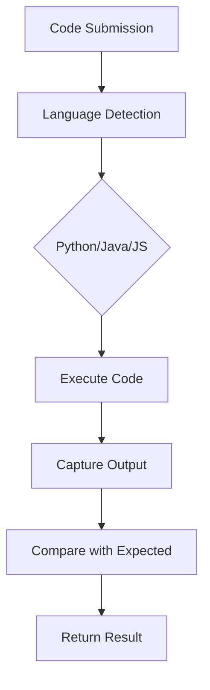

# Simple Three-Language Validation Implementation Plan

## Starting Simple: Visible Test Cases for Java, JavaScript, Python

This plan focuses on implementing basic validation for visible test cases across Java, JavaScript, and Python - following LeetCode's proven approach but simplified for immediate implementation.

## Implementation Strategy

### Phase 1: Foundation Setup (Week 1)

#### 1.1 Simple Test Case Structure
```json
{
  "problem_id": "two-sum",
  "visible_test_cases": [
    {
      "input": "[2,7,11,15]\n9",
      "expected_output": "[0,1]",
      "description": "Basic two-sum case"
    },
    {
      "input": "[3,2,4]\n6",
      "expected_output": "[1,2]",
      "description": "Non-consecutive indices"
    }
  ],
  "languages": ["python", "javascript", "java"]
}
```

#### 1.2 Basic Validation Flow


### Phase 2: Simple Validators (Week 1)

#### 2.1 Python Validator - Basic
```python
class SimplePythonValidator:
    def __init__(self):
        self.limits = {'time_ms': 1000, 'memory_mb': 64}
    
    def validate(self, code, test_case):
        # Simple execution with timeout
        try:
            # Execute code with input
            result = self.execute_python(code, test_case['input'])
            
            # Basic output comparison
            passed = self.compare_outputs(result, test_case['expected_output'])
            
            return {
                'passed': passed,
                'actual_output': result,
                'expected_output': test_case['expected_output'],
                'execution_time': result.get('time_ms', 0),
                'error': result.get('error', None)
            }
        except Exception as e:
            return {'passed': False, 'error': str(e)}
    
    def execute_python(self, code, input_data):
        # Simple execution using subprocess or similar
        # Returns output as string
        pass
```

#### 2.2 JavaScript Validator - Basic
```python
class SimpleJavaScriptValidator:
    def __init__(self):
        self.limits = {'time_ms': 1500, 'memory_mb': 128}
    
    def validate(self, code, test_case):
        try:
            result = self.execute_javascript(code, test_case['input'])
            
            passed = self.compare_outputs(result, test_case['expected_output'])
            
            return {
                'passed': passed,
                'actual_output': result,
                'expected_output': test_case['expected_output'],
                'execution_time': result.get('time_ms', 0),
                'error': result.get('error', None)
            }
        except Exception as e:
            return {'passed': False, 'error': str(e)}
```

#### 2.3 Java Validator - Basic
```python
class SimpleJavaValidator:
    def __init__(self):
        self.limits = {'time_ms': 800, 'memory_mb': 256}
    
    def validate(self, code, test_case):
        try:
            # Compile first
            compiled = self.compile_java(code)
            if not compiled['success']:
                return {'passed': False, 'error': compiled['error']}
            
            # Execute compiled code
            result = self.execute_java(compiled['class_file'], test_case['input'])
            
            passed = self.compare_outputs(result, test_case['expected_output'])
            
            return {
                'passed': passed,
                'actual_output': result,
                'expected_output': test_case['expected_output'],
                'execution_time': result.get('time_ms', 0),
                'error': result.get('error', None)
            }
        except Exception as e:
            return {'passed': False, 'error': str(e)}
```

### Phase 3: Simple Test Runner (Week 1)

#### 3.1 Unified Test Runner
```python
class SimpleTestRunner:
    def __init__(self):
        self.validators = {
            'python': SimplePythonValidator(),
            'javascript': SimpleJavaScriptValidator(),
            'java': SimpleJavaValidator()
        }
    
    def run_test(self, language, code, test_case):
        validator = self.validators.get(language)
        if not validator:
            return {'error': f'Unsupported language: {language}'}
        
        return validator.validate(code, test_case)
    
    def run_all_tests(self, language, code, test_cases):
        results = []
        for test_case in test_cases:
            result = self.run_test(language, code, test_case)
            result['test_case'] = test_case['description']
            results.append(result)
        
        return {
            'total_tests': len(results),
            'passed_tests': sum(1 for r in results if r['passed']),
            'results': results
        }
```

### Phase 4: Basic Output Comparison (Week 1)

#### 4.1 Simple Output Matching
```python
class OutputComparator:
    @staticmethod
    def compare(actual, expected):
        """Simple string comparison with basic normalization"""
        
        # Normalize both outputs
        actual_norm = actual.strip()
        expected_norm = expected.strip()
        
        # Handle different formats
        if actual_norm == expected_norm:
            return True
        
        # Try JSON comparison for arrays/objects
        try:
            actual_json = json.loads(actual_norm)
            expected_json = json.loads(expected_norm)
            return actual_json == expected_json
        except:
            pass
        
        # Try numeric comparison
        try:
            return float(actual_norm) == float(expected_norm)
        except:
            pass
        
        return False
```

### Phase 5: Error Handling & Display (Week 1)

#### 5.1 User-Friendly Error Messages
```python
class ErrorHandler:
    @staticmethod
    def format_error(error_type, message):
        error_map = {
            'syntax': "Syntax Error: Check your code structure",
            'timeout': "Time Limit Exceeded: Your code took too long",
            'memory': "Memory Limit Exceeded: Your code used too much memory",
            'runtime': f"Runtime Error: {message}",
            'output': "Wrong Answer: Output doesn't match expected"
        }
        return error_map.get(error_type, f"Error: {message}")
```

#### 5.2 Simple Results Display
```python
class ResultsDisplay:
    @staticmethod
    def format_results(results):
        output = []
        output.append(f"Test Results: {results['passed_tests']}/{results['total_tests']} passed")
        
        for i, result in enumerate(results['results'], 1):
            status = "✓ PASS" if result['passed'] else "✗ FAIL"
            output.append(f"Test {i}: {result['test_case']} - {status}")
            
            if not result['passed']:
                if result.get('error'):
                    output.append(f"  Error: {result['error']}")
                else:
                    output.append(f"  Expected: {result['expected_output']}")
                    output.append(f"  Actual: {result['actual_output']}")
        
        return "\n".join(output)
```

## Implementation Steps (Week 1)

### Day 1-2: Foundation
- [ ] Create basic test case structure for visible cases
- [ ] Set up simple Python validator with subprocess execution
- [ ] Implement basic output comparison

### Day 3-4: JavaScript & Java
- [ ] Create JavaScript validator using Node.js subprocess
- [ ] Create Java validator with compilation step
- [ ] Test basic validation for all three languages

### Day 5-6: Integration
- [ ] Create unified test runner
- [ ] Add error handling and user-friendly messages
- [ ] Create simple results display

### Day 7: Testing & Polish
- [ ] Test with sample problems (two-sum, valid-parentheses)
- [ ] Add basic performance monitoring
- [ ] Create simple documentation

## Quick Start Commands

```bash
# Test Python validation
python scripts/validate.py --language python --code "print('hello')" --expected "hello"

# Test JavaScript validation
python scripts/validate.py --language javascript --code "console.log('hello')" --expected "hello"

# Test Java validation
python scripts/validate.py --language java --code 'System.out.println("hello");' --expected "hello"

# Run all tests for a problem
python scripts/test_problem.py --problem two-sum --language python
```

## Success Metrics (Simple)

- **Validation Accuracy**: 100% for visible test cases
- **Response Time**: < 2 seconds per test case
- **Error Rate**: < 1% for syntax/runtime errors
- **User Experience**: Clear pass/fail messages

This approach provides immediate value with minimal complexity, focusing on visible test cases and basic validation across the three target languages.